# P5.3 - Informe RA3 sobre el despliegue (Sobre P5.2)
**Víctor Gómez Tejada**

## a) Componentes y funcionamiento de los servicios del servidor

### Componentes utilizados

**Contenedor Docker** ejecuta WildFly de forma aislada.  
**Servidor WildFly** de aplicaciones.  
**Aplicación WAR** aplicación empaquetada, API CRUD de tareas que se despliega en WildFly.  
**Puertos publicados**:
   - 8080: Puerto para acceder a la aplicación desde el navegador o curl.
   - 9990: Puerto de administración para acceder a la consola de gestión de WildFly.  

**Endpoint REST** `/api/tasks` para gestionar tareas.

### Flujo

Cuando escribo una URL en el navegador o hago una petición con curl, el flujo es:

- Mi cliente envía una petición HTTP al puerto 8080.
- El contenedor Docker recibe la petición y la redirige a WildFly.
- WildFly identifica que la petición va a `/crud-file/...` y la envía a la aplicación WAR.
- La aplicación, en la clase `TaskResource`, procesa la petición al endpoint `/api/tasks`.
- Se devuelve la respuesta en formato JSON con la lista de tareas.
- El cliente recibe la respuesta.

### Evidencias

**Paso 1: Levantar el contenedor WildFly**

```bash
docker run -d --name wildfly -p 8080:8080 -p 9990:9990 quay.io/wildfly/wildfly:latest
```

**Paso 2: Ver los puertos**

```bash
docker ps
```

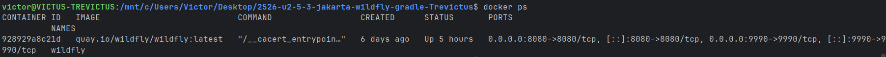

**Paso 3: Ver logs en tiempo real**

```bash
docker logs -f wildfly
```

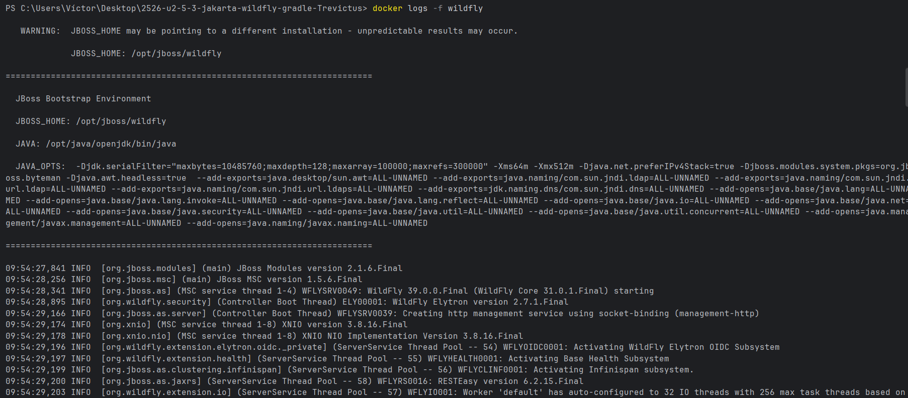

**Paso 4: Instalar Wrapper, y compilar y generar el WAR con Gradle**

```bash
gradlew wrapper

./gradle --version

./gradlew clean build
```

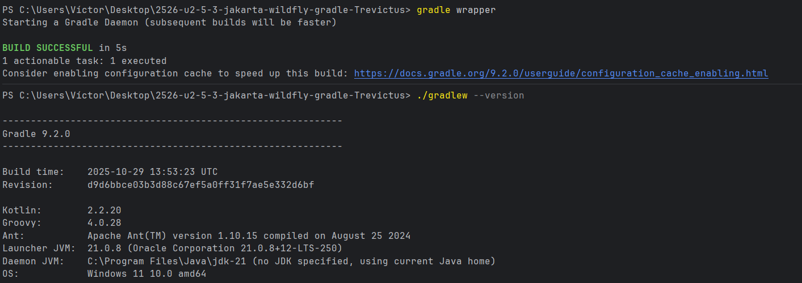

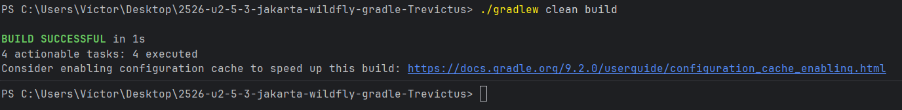

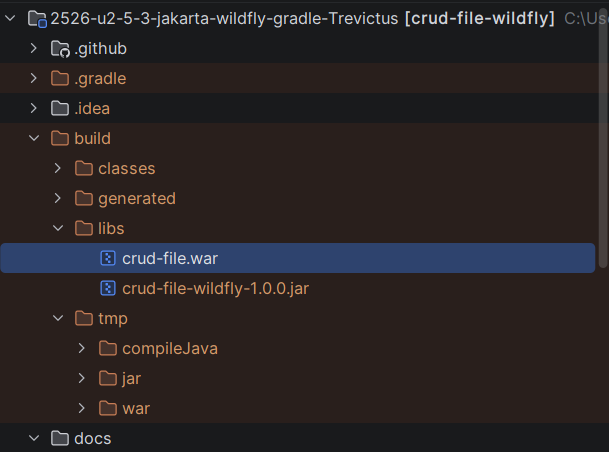

**Paso 5: Copiar el WAR al contenedor**

```bash
docker cp build/libs/crud-file.war wildfly:/opt/jboss/wildfly/standalone/deployments/

```

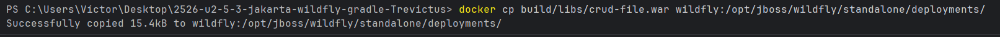

**Paso 6: Probar el endpoint con curl**

```bash
curl -s http://localhost:8080/crud-file/api/tasks
```

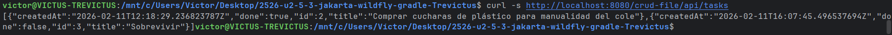

**Paso 7: Crear una tarea con POST**

```bash
curl -d '{"title":"Sobrevivir", "done":false}' -H "Content-Type: application/json"
 -X POST http://localhost:8080/crud-file/api/tasks
```

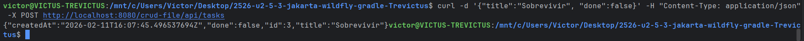
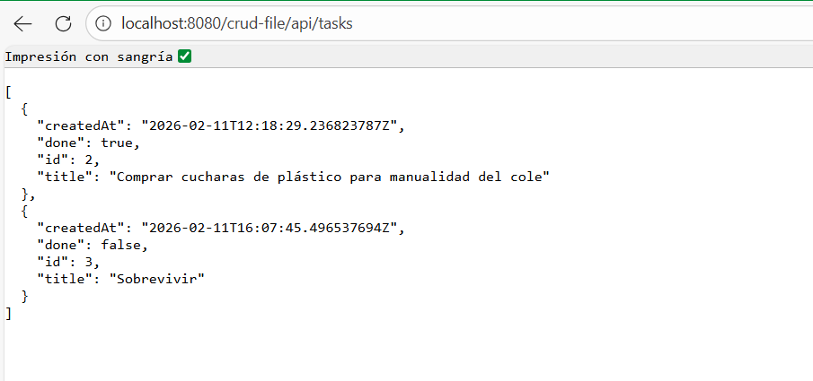

**Paso 8: Ver logs**

```bash
docker logs -f wildfly
```


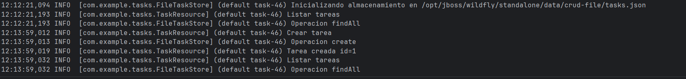

---

## b) Archivos principales de configuración y bibliotecas compartidas

### Archivos de configuración de WildFly

Los archivos principales de configuración están dentro del contenedor en:

```
/opt/jboss/wildfly/standalone/configuration/
```

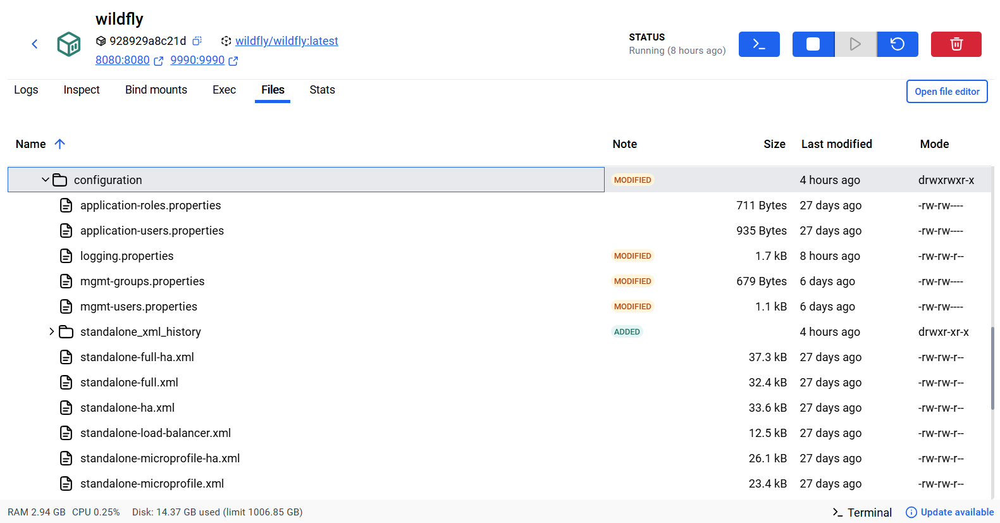

Dentro de esta carpeta, los más importantes son:

- **standalone.xml**
- **standalone-full.xml**
- **application-users.properties**
- **mgmt-users.properties**

Si necesitara hacer cambios en WildFly podría:

- Modificar puertos en `standalone.xml`.
- Cambiar niveles de logging si quisiera ver más o menos información.
- Configurar datasources para conectar a una base de datos.
- Agregar certificados HTTPS/TLS.

En el archivo `build.gradle` está:

```groovy
compileOnly 'jakarta.platform:jakarta.jakartaee-api:10.0.0'
```

Significa que esta dependencia es `compileOnly` porque el servidor WildFly ya incluye la implementación de Jakarta EE. No necesito incluirla en mi WAR.

### Evidencias

**Paso 1: Ver archivos de configuración dentro del contenedor**

```bash
docker exec -it wildfly ls -la /opt/jboss/wildfly/standalone/configuration/
```

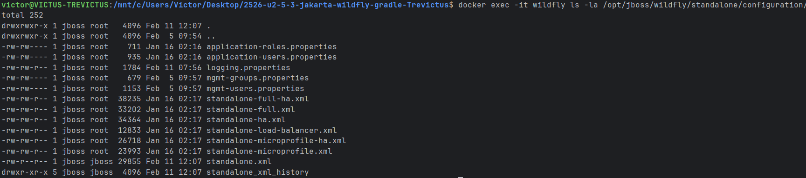

**Paso 2: Ver contenido de standalone.xml**

```bash
docker exec -it wildfly head -n 50 /opt/jboss/wildfly/standalone/configuration/standalone.xml
```

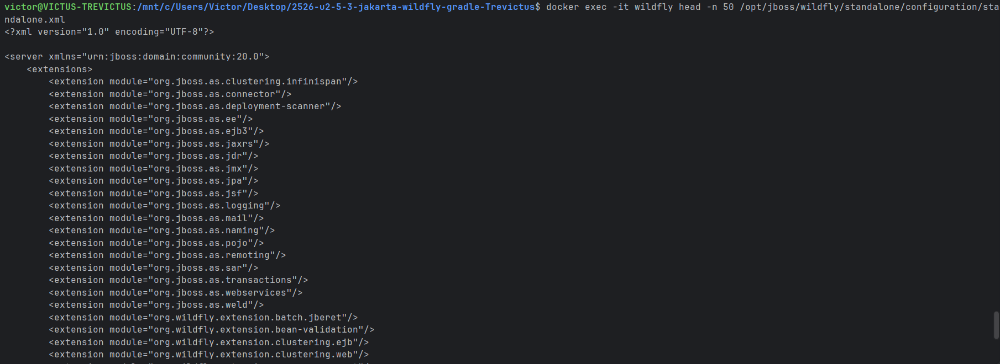

**Paso 3: Ver build.gradle mostrando dependencias provided**

En el IDE, abrir el archivo `build.gradle` y mostrar:

```groovy
compileOnly 'jakarta.platform:jakarta.jakartaee-api:10.0.0'
```

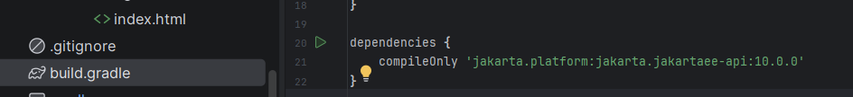

---

## c) Cooperación con el servidor web (proxy/reverse proxy) y https

**Actualmente en P5.2 Accedo directamente a WildFly por `localhost:8080` expongo los puertos 8080 y 9990 y comunico en HTTP sin cifrar.**

**En un entorno real Nginx recibe las peticiones en puerto 80 (HTTP) y 443 (HTTPS), redirige internamente a WildFly por `localhost:8080`, no se espone el puerto 9990 hacia afuera y cifro la comunicación con HTTPS**

### Configuración Nginx de ejemplo

```nginx
server {
    listen 80;
    server_name localhost;

    return 301 https://$server_name$request_uri;
}

server {
    listen 443 ssl;
    server_name localhost;

    ssl_certificate /etc/nginx/certs/server.crt;
    ssl_certificate_key /etc/nginx/certs/server.key;

    ssl_protocols TLSv1.2 TLSv1.3;
    ssl_ciphers HIGH:!aNULL:!MD5;

    location /api/ {
        proxy_pass http://wildfly:8080/crud-file/api/;
        proxy_set_header Host $host;
        proxy_set_header X-Real-IP $remote_addr;
        proxy_set_header X-Forwarded-For $proxy_add_x_forwarded_for;
        proxy_set_header X-Forwarded-Proto $scheme;
    }

    location /admin {
        return 403;
    }
}
```

**Cambia con reverse proxy**:
- El cliente accede por `https://localhost/api/tasks` en lugar de `http://localhost:8080/crud-file/api/tasks`
- Nginx cifra la comunicación con TLS
- El puerto 9990 no está expuesto

**Las ventajas con HTTPS/TLS son**:  
- Los datos viajan cifrados, no se ven en claro por la red.
- Garantiza que nadie ha modificado los datos en tránsito.
- El cliente sabe que conecta al servidor correcto (mediante certificados).
- Los navegadores muestran un icono de candado.

### Puertos a publicar en Docker

Con reverse proxy, él `docker run` cambiaría a:

```bash
docker run -d --name wildfly \
  -p 8080:8080 \
  -p 9990:9990 \
  quay.io/wildfly/wildfly:latest

docker run -d --name nginx \
  -p 80:80 \
  -p 443:443 \
  -v /path/to/nginx.conf:/etc/nginx/nginx.conf:ro \
  -v /path/to/certs:/etc/nginx/certs:ro \
  nginx:latest
```

Solo expongo 80 y 443 (Nginx) hacia el exterior. WildFly está en la red privada.

---

## d) Mecanismos de seguridad del servidor de aplicaciones

#### 1. Consola de administración (9990) y credenciales.

**Lo que hice**:
- Creé un usuario de administración con credenciales fuertes.

```bash
docker exec -it wildfly /opt/jboss/wildfly/bin/add-user.sh
```

Elegí "Management User" y asigné un usuario y contraseña.

**Lo que añadiría para producción**:
- El puerto 9990 no debe exponerse hacia fuera.
- Usar un firewall para bloquear acceso desde internet.
- Cambiar la contraseña por defecto regularmente.
- Habilitar HTTPS en la consola de administración.

#### 2. Exposición de puertos

**Lo que hago**:
- Expongo 8080 y 9990.

**Lo que añadiría**:
- En producción, solo exponer el puerto 80/443 (a través de un reverse proxy como Nginx).
- El puerto 9990 debe estar en una red privada, accesible solo para administradores.
- Usar un firewall para bloquear puertos innecesarios.

#### 3. Gestión de secretos (Usuarios/contraseñas)

**Lo que hice**:
- WildFly almacena usuarios en archivos de propiedades (`mgmt-users.properties`, `application-users.properties`).

**Lo que recomiendo**:
- Nunca hardcodear credenciales en código.
- Usar variables de entorno o un gestor de secretos como:
  - Docker Secrets
  - Kubernetes Secrets
  - HashiCorp Vault
- Cambiar contraseñas por defecto.

Ejemplo usando variables de entorno:
```bash
docker run -e ADMIN_USER=admin -e ADMIN_PASSWORD=secreto123 wildfly
```

#### 4. Registro y trazabilidad (Logs)

**Lo que hice**:
- Los logs de WildFly se guardan en el contenedor en `/opt/jboss/wildfly/standalone/log/`

```bash
docker logs -f wildfly
```

**Lo que recomiendo**:
- Exportar logs a un fichero en el host o a una plataforma centralizada.
- Mantener logs por tiempo (rotación): por ejemplo, guardar solo 30 días.
- Registrar eventos importantes: creación de usuarios, cambios de configuración, accesos fallidos.
- No loguear información sensible.

### Evidencias

**Paso 1: Puertos expuestos**

```bash
docker ps --no-trunc
```
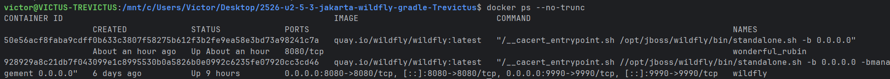

---

## e) Componentes web del servidor de aplicaciones

### Qué es el WAR y qué contiene

El WAR (Web Application Archive) es un fichero comprimido (ZIP) que contiene mi aplicación empaquetada para ser desplegada en un servidor. 

- Las clases Java están compiladas (`.class`).
- No incluye las librerías de Jakarta EE (porque el servidor ya las proporciona).
- Es un formato estándar para aplicaciones Java web.

### Contexto/ruta base de la aplicación

El **contexto** es la carpeta dentro de WildFly donde se despliega la aplicación:

- Nombre del WAR: `crud-file.war`
- Contexto: `/crud-file`

En este caso:

```java
@ApplicationPath("/api")
public class TasksApplication extends Application {
}
```

Si juntamos todo:
- Contexto WAR: `/crud-file`
- Ruta de aplicación: `/api`
- Ruta del recurso: `/tasks`

`http://localhost:8080/crud-file/api/tasks`

### Qué parte del servidor se encarga de servir la API

En WildFly, el **contenedor web** Undertow es la parte responsable de recibir peticiones HTTP, identificar a qué aplicación WAR van, enrutar a las clases Java correctas y devolver respuestas HTTP.

### Desglose de URL real

URL: `http://localhost:8080/crud-file/api/tasks/1`

- **http**: Protocolo (inseguro).
- **localhost**: Host (el servidor local).
- **8080**: Puerto (donde WildFly escucha).
- **/crud-file**: Contexto de la aplicación WAR.
- **/api**: Ruta de la aplicación REST.
- **/tasks**: Ruta del recurso REST.
- **/1**: Parámetro de ruta (ID de la tarea).

### Evidencias

**Paso 1: URLs probadas en navegador/curl.**

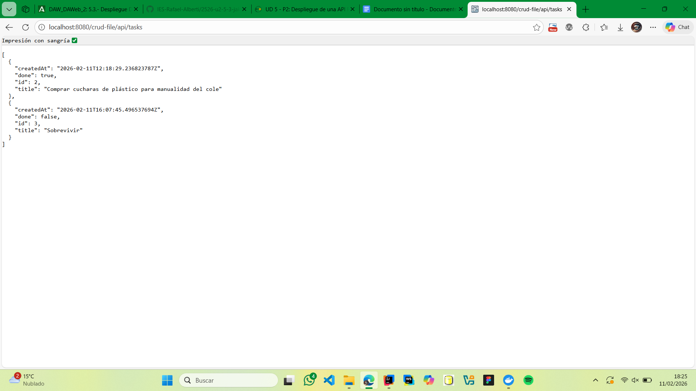

**Paso 2: Log del servidor mostrando el acceso.**

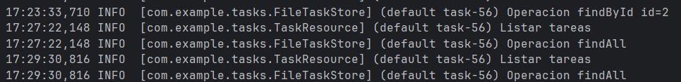

---

## f) Parámetros necesarios para el despliegue

### Parámetros de `docker run`

**Comando ejecutado**:
```bash
docker run -d --name wildfly -p 8080:8080 -p 9990:9990 quay.io/wildfly/wildfly:latest
```

Parámetros:

| Parámetro | Valor | Justificación | Consecuencia si falta |
|-----------|-------|---------------|----------------------|
| `-d` | (flag) | Ejecutar en segundo plano | Sin esto, ocuparía la terminal |
| `--name` | `wildfly` | Nombre del contenedor | Sin nombre, asigna uno aleatorio |
| `-p 8080:8080` | puerto:puerto | Publicar puerto 8080 | Sin esto, no accedo desde `localhost:8080` |
| `-p 9990:9990` | puerto:puerto | Publicar puerto admin | Sin esto, no accedo a consola |
| Imagen | `quay.io/wildfly/wildfly:latest` | Imagen oficial | Si es otra, fallaría |

### Parámetros del WAR y despliegue

| Parámetro | Valor | Justificación | Consecuencia si falta |
|-----------|-------|---------------|----------------------|
| Nombre del WAR | `crud-file.war` | Definido en `build.gradle` | Si fuera otro, cambiaría el contexto |
| Ruta de despliegue | `/opt/jboss/wildfly/standalone/deployments/` | Ruta estándar | Si fuera otra, no lo encontraría |

### Parámetros de Gradle

```groovy
war {
    archiveFileName = 'crud-file.war'
}
```

| Parámetro | Valor | Justificación | Consecuencia si falta |
|-----------|-------|---------------|----------------------|
| Plugin `war` | (activado) | Genera `.war` | Sin él, genera `.jar` |
| `compileOnly` | `jakarta.jakartaee-api:10.0.0` | Dependencias provided | Si usara `implementation`, conflictos |
| `archiveFileName` | `crud-file.war` | Nombre del WAR | Si fuera otro, cambia el contexto |

---

## g) Pruebas de funcionamiento y rendimiento

### Pruebas funcionales

**Test 1: Listar tareas (GET)**

```bash
curl -s http://localhost:8080/crud-file/api/tasks
```

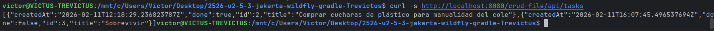

**Test 2: Crear una tarea (POST)**

```bash
curl -d '{"title":"Sobrevivir", "done":false}' -H "Content-Type: application/json" -X POST http://localhost:8080/crud-file/api/tasks
```


**Test 3: Eliminar tarea (DELETE)**

```bash
curl -s -X DELETE http://localhost:8080/crud-file/api/tasks/1
```

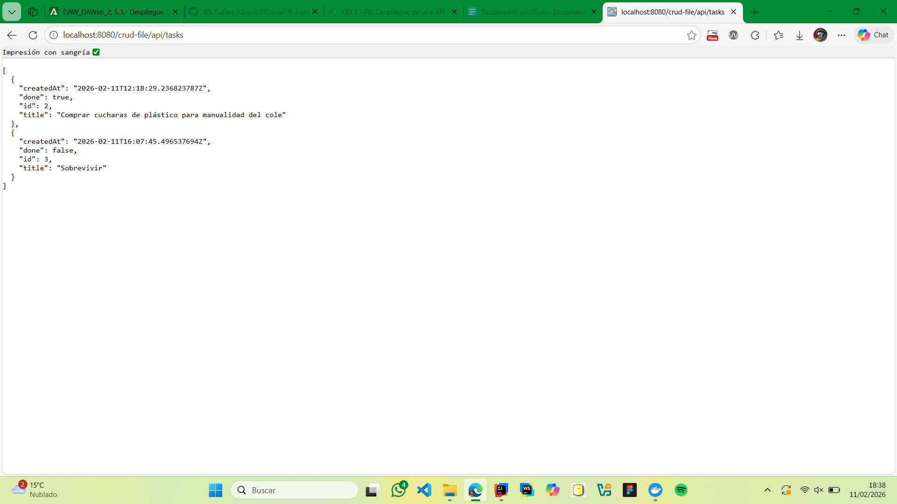
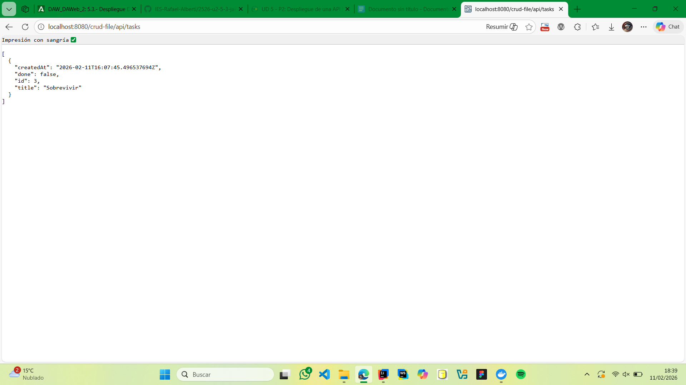

### Pruebas de rendimiento con ApacheBench

```bash
hey -n 1000 -c 10 http://localhost:8080/crud-file
```

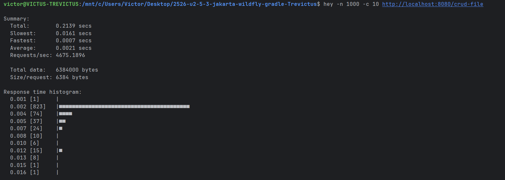
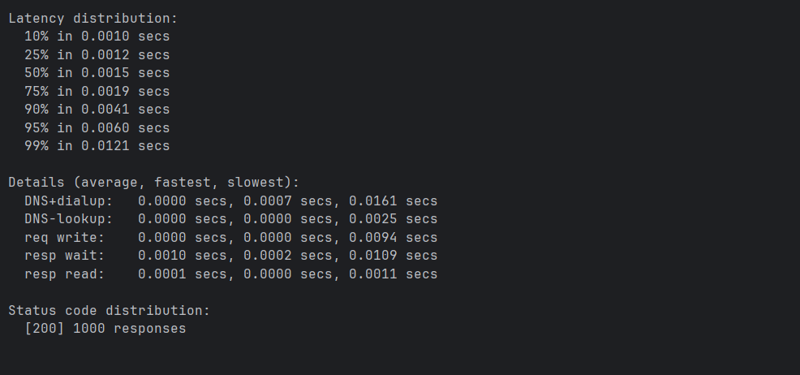

### Análisis de resultados

Summary:
Total:        0.2139 secs
Slowest:      0.0161 secs
Fastest:      0.0007 secs
Average:      0.0021 secs
Requests/sec: 4675.1896

Total data:   6384000 bytes
Size/request: 6384 bytes

Status code distribution:
[200] 1000 responses

---

## h) Documentación de administración y recomendaciones

### Mini-guía de administración

#### 1. Cómo levantar WildFly

```bash
docker run -d --name wildfly -p 8080:8080 -p 9990:9990 quay.io/wildfly/wildfly:latest
docker ps | findstr wildfly
```

#### 2. Cómo desplegar una nueva versión del WAR

```bash
./gradlew war
docker cp build\libs\crud-file.war wildfly:/opt/jboss/wildfly/standalone/deployments/
docker logs -f wildfly
```

#### 3. Cómo comprobar el estado

```bash
docker logs -f wildfly
curl -s http://localhost:8080/crud-file/api/tasks
```

#### 4. Recomendaciones para evitar errores comunes

| Error | Causa | Solución |
|-------|-------|----------|
| "localhost:8080 rechazado" | Puerto no publicado | Revisar `docker ps` |
| "Error 404" | WAR no desplegado | Ver logs: `docker logs wildfly` |
| "Consola admin rechazada" | Usuario no creado | Ejecutar `add-user.sh` |
| "Contenedor se detiene" | Falta memoria | Aumentar `-m` |

---

## i) Virtualización, nube o contenedores en el despliegue (Docker Compose)

### Arquitectura propuesta

```
Cliente
  |
  v (HTTPS, puerto 443)
[Nginx] Proxy inverso
  |
  v (red privada)
[WildFly] Servidor aplicaciones
  |
  v
API REST CRUD
```

### Archivo docker-compose.yml

```yaml
version: '3.8'

services:
  nginx:
    image: nginx:latest
    container_name: nginx-proxy
    ports:
      - "80:80"
      - "443:443"
    volumes:
      - ./nginx.conf:/etc/nginx/nginx.conf:ro
      - ./certs:/etc/nginx/certs:ro
      - nginx-logs:/var/log/nginx
    depends_on:
      - wildfly
    networks:
      - app-network
    restart: always
    healthcheck:
      test: ["CMD", "curl", "-f", "http://localhost/health"]
      interval: 30s
      timeout: 10s
      retries: 3

  wildfly:
    image: quay.io/wildfly/wildfly:latest
    container_name: wildfly-app
    expose:
      - "8080"
      - "9990"
    volumes:
      - ./build/libs/crud-file.war:/opt/jboss/wildfly/standalone/deployments/crud-file.war:ro
      - wildfly-data:/opt/jboss/wildfly/standalone/data
      - wildfly-logs:/opt/jboss/wildfly/standalone/log
    networks:
      - app-network
    restart: always
    deploy:
      resources:
        limits:
          cpus: '2'
          memory: 1G
        reservations:
          cpus: '1'
          memory: 512M
    healthcheck:
      test: ["CMD", "curl", "-f", "http://localhost:8080/crud-file/api/tasks"]
      interval: 30s
      timeout: 10s
      retries: 3

volumes:
  wildfly-data:
    driver: local
  wildfly-logs:
    driver: local
  nginx-logs:
    driver: local

networks:
  app-network:
    driver: bridge
```

### Archivo nginx.conf (fragmento principal)

```nginx
server {
    listen 80;
    server_name localhost;
    return 301 https://$server_name$request_uri;
}

server {
    listen 443 ssl;
    server_name localhost;

    ssl_certificate /etc/nginx/certs/server.crt;
    ssl_certificate_key /etc/nginx/certs/server.key;
    ssl_protocols TLSv1.2 TLSv1.3;

    location /api/ {
        proxy_pass http://wildfly:8080/crud-file/api/;
        proxy_set_header Host $host;
        proxy_set_header X-Real-IP $remote_addr;
        proxy_set_header X-Forwarded-For $proxy_add_x_forwarded_for;
        proxy_set_header X-Forwarded-Proto $scheme;
    }

    location /admin {
        return 403;
    }

    location /health {
        access_log off;
        return 200 "healthy\n";
        add_header Content-Type text/plain;
    }
}
```

### Cómo generar certificados autofirmados

```bash
openssl req -x509 -newkey rsa:2048 -keyout certs\server.key -out certs\server.crt -days 365 -nodes -subj "/CN=localhost"
```

### Comandos de operación

```bash
# Levantar todo
docker-compose up -d

# Ver logs
docker-compose logs -f

# Ver estado
docker-compose ps

# Detener
docker-compose down

# Reiniciar un servicio
docker-compose restart wildfly
```

### Acceso

**Desde el host**:
- HTTPS: `https://localhost/api/tasks`

**Desde dentro de la red**:
- WildFly: `http://wildfly:8080/crud-file/api/tasks`

### Ventajas de esta configuración

1. **Seguridad**: Nginx maneja HTTPS; WildFly no está expuesto.
2. **Escalabilidad**: Fácil agregar más instancias.
3. **Resiliencia**: Health checks y restart automático.
4. **Persistencia**: Volúmenes para datos y logs.
5. **Aislamiento**: Red privada entre contenedores.
6. **Límites**: CPU y memoria controladas.
